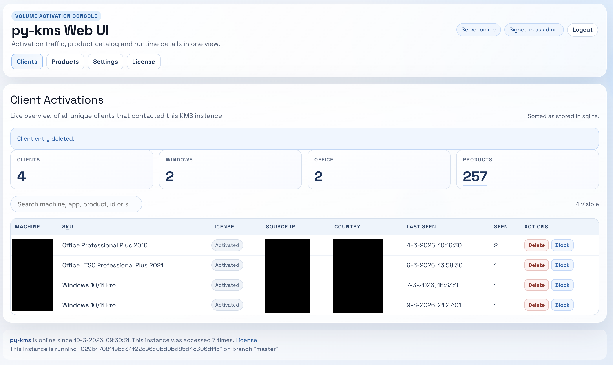

# py-kms

_This project is intended for testing and learning, not for production use._

## Project Lineage
This repository is a **fork of a fork**:
- forked from `Py-KMS-Organization/py-kms`
- which is itself a fork of `SystemRage/py-kms`

## Overview
`py-kms` is a Python KMS server emulator with Docker-first runtime and a built-in WebUI.

Main capabilities:
- KMS protocol support: `v4`, `v5`, `v6`
- SQLite persistence for client activations
- WebUI pages for clients, products, settings and license
- WebUI pagination and sorting for client overview
- Source IP tracking and startup backfill from log files
- Source IP blacklist (single IP, CIDR, range)
- Blocked-attempt counters per rule and source IP
- Country display (flag + name) next to source IP in clients table



## Docker Images and Tags
Only one image variant is maintained.

- `ghcr.io/melroyb/py-kms:python3`
- `ghcr.io/melroyb/py-kms:latest`

Container registries:
- GitHub Container Registry image tag: `ghcr.io/melroyb/py-kms:latest`
- Docker Hub image tag: `melroy/py-kms:latest`

`latest` and `python3` are built from the same Dockerfile and point to the same build output.

## Quick Start

### Run from source (repo root)
```bash
python3 py-kms/pykms_Server.py [IPADDRESS] [PORT]
```

Help:
```bash
python3 py-kms/pykms_Server.py -h
python3 py-kms/pykms_Client.py -h
```

### Run with Docker
```bash
docker run -d \
  --name py-kms \
  --restart always \
  -p 1688:1688 \
  -p 8080:8080 \
  -v pykms-db:/home/py-kms/db \
  melroy/py-kms:latest
```

You can also start from the provided env example:
- [docker/.env.example](./docker/.env.example)

Docker-specific details are in:
- [docker/README.md](./docker/README.md)

## Important Environment Variables

### Core
- `IP` (default `::`)
- `PORT` (default `1688`)
- `LOGLEVEL` (default `INFO`)
- `LOGFILE` (default `STDOUT`)
- `LOGSIZE` (default empty)
- `CLIENT_COUNT` (default `26`)
- `HWID` (default `RANDOM`)
- `WEBUI` (default `1`)

### WebUI Authentication and Session Security
- `PYKMS_WEBUI_PASSWORD` (required to enable login)
- `PYKMS_WEBUI_USERNAME` (default `admin`)
- `PYKMS_WEBUI_SECRET_KEY` (recommended)
- `PYKMS_WEBUI_COOKIE_SECURE` (default `false`)
- `PYKMS_WEBUI_COOKIE_SAMESITE` (default `Lax`)
- `PYKMS_WEBUI_SESSION_TTL_SECONDS` (default `43200`)
- `PYKMS_WEBUI_LOGIN_RATE_LIMIT_ATTEMPTS` (default `5`)
- `PYKMS_WEBUI_LOGIN_RATE_LIMIT_WINDOW_SECONDS` (default `300`)
- `PYKMS_WEBUI_LOGIN_RATE_LIMIT_BLOCK_SECONDS` (default `900`)
- WebUI shows a visible warning when a default password value is used.

### Blacklist
- `PYKMS_BLACKLIST_PATH` (default `/home/py-kms/db/pykms_blacklist.txt`)
- `PYKMS_BLACKLIST_STATS_PATH` (default `/home/py-kms/db/pykms_blacklist_stats.json`)

### Source IP Backfill
- `PYKMS_SOURCEIP_BACKFILL_ON_START` (default `1`)
- `PYKMS_SOURCEIP_BACKFILL_GLOB` (default `/home/py-kms/db/pykms_logserver.log*`)
- `PYKMS_SOURCEIP_BACKFILL_LOGS` (optional explicit comma-separated list; overrides glob)

### GeoIP (Country in Clients WebUI)
- `PYKMS_GEOIP_ENABLED` (default `1`)
- `PYKMS_GEOIP_PROVIDER` (default `ipapi.co`)
- `PYKMS_GEOIP_TIMEOUT_SECONDS` (default `2`)
- `PYKMS_GEOIP_CACHE_TTL_SECONDS` (default `604800`)
- `PYKMS_GEOIP_ERROR_CACHE_TTL_SECONDS` (default `900`)
- `PYKMS_GEOIP_MAX_LOOKUPS_PER_REQUEST` (default `20`)

### Clients WebUI Pagination
- `PYKMS_WEBUI_CLIENTS_PER_PAGE` (default `100`)
- `PYKMS_WEBUI_CLIENTS_MAX_PER_PAGE` (default `500`)

## Notes
- For persistence, mount `/home/py-kms/db` as a volume.
- If `LOGFILE=STDOUT`, source-IP startup backfill has no log files to parse.
- GeoIP lookup uses an external provider by default (`ipapi.co`), so public source IPs may be sent to that service.
- On container startup, missing required runtime files are auto-created (touch), including db/blacklist/stats files and custom logfile paths.

## License
`py-kms` is released under [The Unlicense](./LICENSE).
